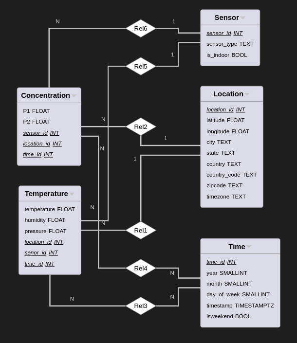
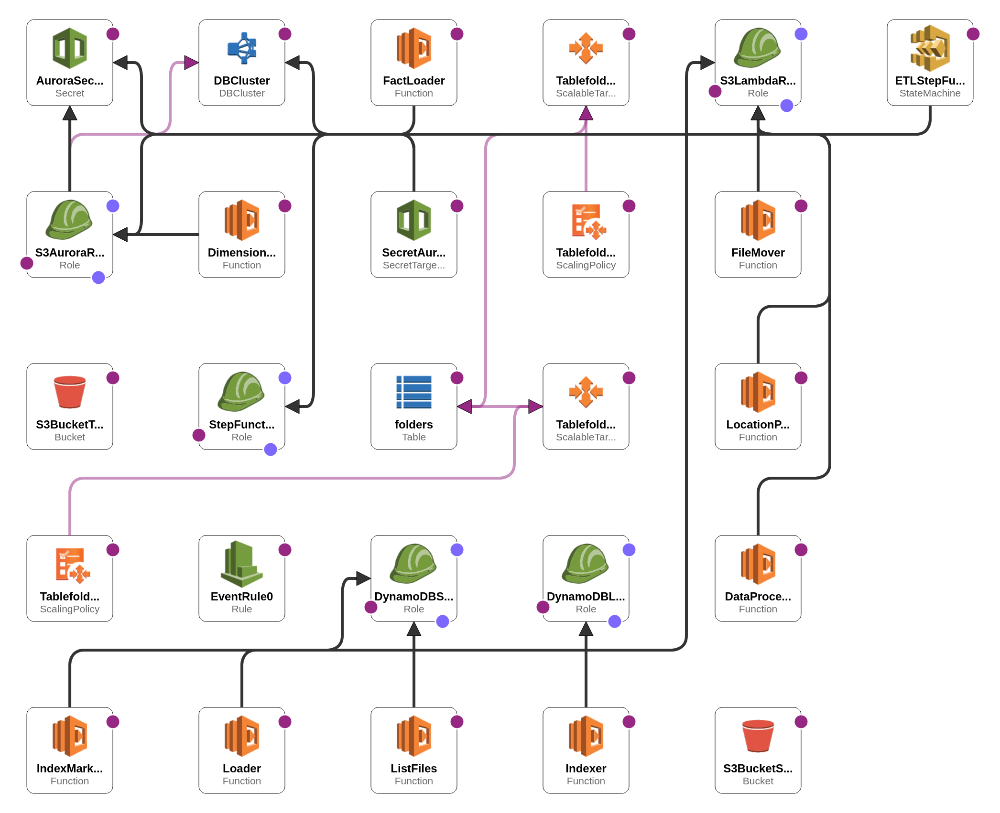

# Air-quality-data
Serverless ETL pipeline and OLAP database for air quality data analitics based on AWS cloud 

## Intoduction
[Sensor.Community](https://sensor.community/en/) build, deploy and collect data from air quality sensors.
Data is publicly available - you can see current value on a map or download historical data from [archive](https://archive.sensor.community/) starting from 2015.
But the data in the archive is aggregated only by date - it makes any analytics difficult - because you typically want to have other aggregations like country, city, proximity to some point, etc.
The goal of this project is to build a cloud-based (for data processing parallelization) serverless (to reduce cost with uneven computing power consumption) ETL pipeline and OLAP database for 
air quality data analitics.

## Data model


We use star schema for the database with 2 fact tables (concentration and temperature) to store measurements from sensors and 3 dimension tables. P1 and P2 are pm2.5 and pm10 particles concentration. Sensor_type store type of sensor (like 'bme289' or 'sds011'), is_indoor indicates when the sensor is install inside a room. We get address information from sensor lat and long using [
Nominatim](https://nominatim.org/) API.

## Pipeline


Our data processing pipeline is built from the AWS Lambda function orchestrated by AWS StepFunction. Input for step function should specify a date interval for data downloading:
``` json
{
  "startDate": "2022-03-01",
  "endDate": "2022-03-02"
}
```
### Extraction
Steps:
- select folders with files to download based on dates and put them into the DynamoDB table;
- for each folder get and filter a list of files to download, and save a list of files on S3;
- download data files into staging-area S3 bucket;
- mark folder in DynamoDB as processed;
### Transformation
Iterate over all new files (with batching) in the staging area and:
- extract location information (lat, lon), request Nomination API to get location details;
- extract sensor type;
- extract measurements, filter for empty and unrealistic values, average within 1 hour;
for each batch write results into files in the transformed bucket and move processed files to another folder in the staging area bucket.
### Loading
- read files with sensor, time, and location info from the transformed bucket and upload data into dimension tables, and remove processed files from the transformed bucket;
- read files with concentration and temperature data and load it into fact tables, and remove processed files from the transformed bucket;

## Resources


The following AWS services uses:
- S3 - to store raw and transformed files;
- DynamoDB - to track which data downloaded;
- Lambda Functions - to perform computations;
- Step Functions - to orchestrate lambda functions;
- Aurora - host serverless PostgreSQL cluster;
- CloudFormation - other services configuration and deployment;

## Deployment
If you want to run this application in your own AWS cloud, you need to do a few steps:
1. Fork repository.
2. Set appropriate value for the following GitHub repository secrets (`Settings -> Secrets and Variables -> Actions`):
  - `AWS_ACCESS_KEY_ID`
  - `AWS_SECRET_ACCESS_KEY`
  - `AWS_ACCOUNT_ID`
  - `AWS_REGION`
  - `DB_PASSWORD` - password for Aurora PostgreSQL cluster 
  - `DB_USERNAME` - username for Aurora PostgreSQL cluster
  - `STAGING_AREA_BUCKET` - bucket name for raw data files
  - `TRANSFORMATION_BUCKET` - bucket name for transformed data
  - `STEP_FUNCTION_BUCKET` - bucket name for step function definition uploading during deployment
3. Go to `Actions -> Deploy ETL pipeline` and press the run workflow button. It will build docker images for Lambda functions, push them to ECR, and deploy the CloudFormation stack.
4. After deployment, you need to go to your AWS StepFunction console and run the execution of ETLStepFunction with appropriate `startDate` and `endDate` values.
5. To see some database querie examples, you can check the `queries/` folder.  